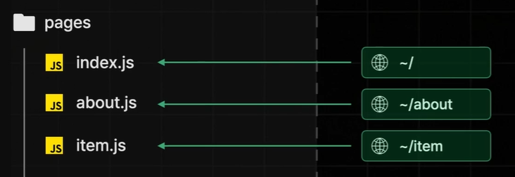

# week2

### Page Router

- **page router** : pages 폴더의 구조를 기반으로 페이지를 라우팅
    - pages 폴더 아래에 들어있는 파일명을 기반으로 페이지 라우팅
        
        
        
    - 이때 폴더 이름을 기준으로도 페이지 라우팅 설정 가능
        
        
        
    - 동적 경로에 대응하는 페이지 라우팅의 경우
        
        
        
- page router 버전의 **Next App 생성**하기
    
    ```bash
    npx create-next-app@14 section02
    ```
    
    
    
    - test.tsx 코드와 결과
        
        ```bash
        export default function Page() {
          return <h1>TEST</h1>;
        }
        ```
        
        
        
    - _app.tsx & _document.tsx : Next App의 모든 페이지에 공통적으로 적용될 로직이나 레이아웃 또는 데이터를 다루기 위한 파일
        
        
        
        - **_app.tsx** : Next.js에서는 어떤 페이지를 렌더링하던 간에
            - 앱 컴퍼넌트 밑에 페이지 역할을 하는 컴퍼넌트가 렌더링되는 구조
                
                
                
                
                
        - **_document.tsx** : 모든 페이지에 공통적으로 적용되어야 하는
            - Next.js 앱의 HTML 코드를 설정하는 컴퍼넌트